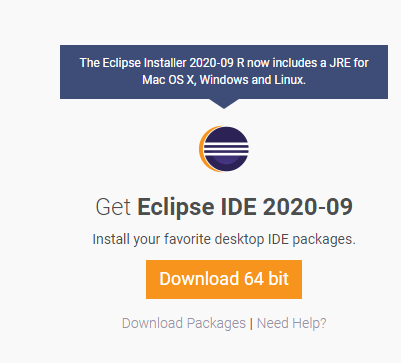

# 02. 자바와 이클립스 설치하기

## 1. 자바 설치 하기
   
[자바 JDK 설치](https://www.oracle.com/java/technologies/javase-jdk15-downloads.html)

[자바 JRE 설치](https://www.oracle.com/java/technologies/javase-jre8-downloads.html)

자바는 유료화 이후 JRE는 8.0까지만 무료 제공 (원래는 JDK와 같이 설치 됬지만, 유료화로 인해 분리)

## 2. 이클립스 설치 하기

[이클립스 설치](https://www.eclipse.org/downloads/)

이클립스는 지속적으로 업그레이드 됨
(현재 Eclipse IDE를 설치 하면  JAVA JRE가 플러그인으로 들어가 있어서 따로 자바를 설치를 안해도 됨)

(하지만 Eclipse를 사용하지 않는 경우가 있으니 따로 자바 설치필요)

## 3. 다음 강의 
[03. 자바 첫 프로그램 만들고 실행하기](https://github.com/vivalahm/TIL/blob/main/JAVA/Chapter1/01-03/2021-02-27-CH01-03.md)
