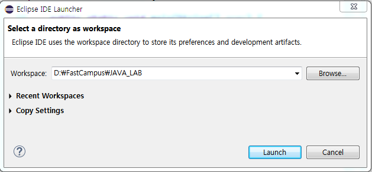
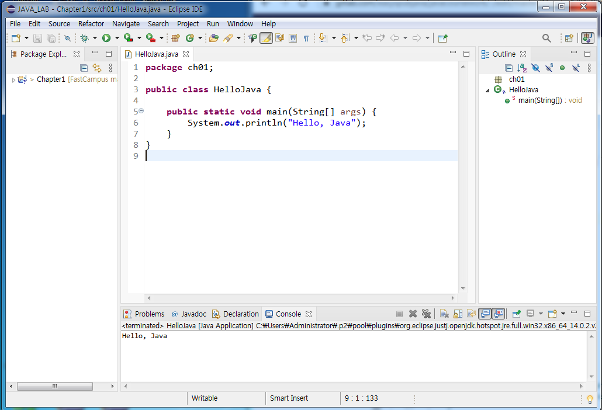
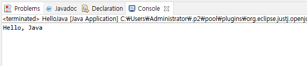

# 03. 자바 첫 프로그램 만들고 실행하기

## 이클립스 실행하기

 * WorkSpace 설정
 
   

 * 프로젝트 만들기와 화면의 구성(새로 만들기 단축키 ctrl + n)

   

  *모든 클래스는 패키지안에 들어가는게 좋다. (Java Project => Package => Class)

- 만약 패키지 생성 안하고 소스를 넣으면 디폴드(패키지 없는 상태)로 들어감
- 패키지는 일종의 소스의 묶음이라고 보면된다. +패키지 이름은 소문자로 쓴다.(대문자는 안씀 Convention 즉, 통상적인 규칙)
- 클래스 이름은 대문자로 시작하는게 좋다.( 마찬가지 강제는 아니고 통상적 규칙)
- 소스 코드를 작성 중일때 *표시가 뜨는데 저장을 하면 자동으로 컴파일 된다.
- 보통 java파일 하나당 클래스하나 이지만, 클래스가 여러개가 들어갈 경우가 있다.
- Public의 경우 클래스가 하나만 있어야한다. 
- java파일은 src에 있고, 컴파일 된 Class파일은 bin에 있으며 실제로 구동 되는 것은 class파일이다.

## 첫 프로그램 "Hello, Java" 출력하기

(실행 핫키는 ctrl + f11)

```
package ch01;

public class HelloJava {

	public static void main(String[] args) {
		System.out.println("Hello, Java");
	}
}
```



## 다음 강의 
[04. 컴퓨터에서 자료 표현하기](https://github.com/vivalahm/TIL/blob/main/JAVA/Chapter1/01-04/2021-02-27-CH01-04.md)
