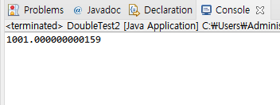

# 07. 자료형(data type) - 실수는 어떻게 표현하나요?

## - 부동 소수점 방식
   -  실수는 정수 보다 정밀하기 때문에 정수와는 다른 방식으로 표현해야 함
   
   -  부동 소수점 방식으로 실수 값 0.1 표현 

      

   -  지수부와 가수부로 표현 함

   - 컴퓨터에서는 밑수를 2로 사용

   - 정규화 : 가수가 밑수보다 작은 한 자리까지 가수로 표현 되는 것

   - 컴퓨터에서는 밑수가 2 이므로 정규화를 하게 되면 가수부분의 첫 번째 자리 숫자는 항상 1임 <br>
     예) 0.2 표현 0.4 X 2<sup>-1</sup>  정규화 하면 1.6 X 2<sup>-3</sup> 

## - float형과 double형 
   

   자바에서는 실수의 기본 타입은 dobule을 사용 함


## - float 와 double 예제
```
   package ch07;

   public class DoubleTest {

	   public static void main(String[] args) {
		   double dnum = 3.14;
		   float fnum = 3.14F;
		
		   System.out.println(dnum);
		   System.out.println(fnum);
	   }
   }
```


## - 부동 소수점 방식의 오류
   지수와 가수로 나타내는 부동 소수점 방식에서는 지수부가 0을 표현할 수 없기 때문에 약간의 오차가 발생할 수 있다

```
   public class DoubleTest2 {

	public static void main(String[] args) {

		double dnum = 1;
		
		for(int i = 0; i<10000; i++) {
			dnum = dnum + 0.1;
		}
		System.out.println(dnum);
	}
}
```

   출력 결과 

   

## 다음 강의
[08. 자료형(data type) - 문자는 프로그램에서 어떻게 표현하여 사용하나요?](https://github.com/vivalahm/TIL/tree/main/JAVA/Chapter1/01-08)
