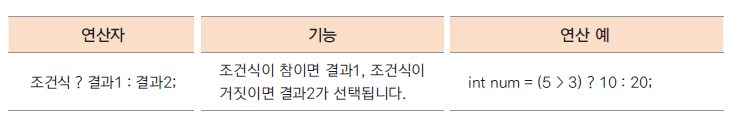
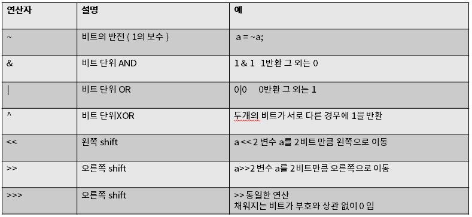
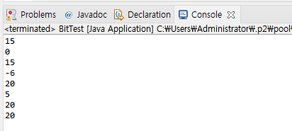

# 13. 자바의 연산자들 -3 (조건 연산자, 비트 연산자)

## 조건 연산자

- 삼항 연산자(조건문의 축약형)

- 조건식의 결과가 true(참)인 경우와 false(거짓)인 경우에 따라 다른 결과가 수행됨 

- if (조건문)을 간단히 표현할 때 사용 할 수 있음




```java
package ch13;

import java.util.Scanner;

public class ConditionTest {

	public static void main(String[] args) {

		int max;
		System.out.println("입력 받은 두 수중 큰 수를 출력하세요\n ");
		
		Scanner scanner = new Scanner(System.in);
		System.out.println("입력1:");
		int x = scanner.nextInt();
		System.out.println("입력2:");
		int y = scanner.nextInt();
		
		max = (x > y)? x : y;
		System.out.println(max);
	}
}
```


## 비트 연산자

- 대입연산자와 다른 연산자가 함께 쓰임

- 마스크 : 특정 비트를 가리고 몇 개의 비트 값만 사용할 때

- 비트켜기 : 특정 비트들만을 1로 설정해서 사용하고 싶을 때<br>
      예)  & 00001111 ( 하위 4비트 중 1인 비트만 꺼내기(마스킹- 특정 비트를 가리고 나머지 비트만 사용하는 방법 ))

- 비트끄기 : 특정 비트들만을 0으로 설정해서 사용하고 싶을 때<br>
      예)  | 11110000 ( 하위 4비트 중 0 인 비트만 0으로 만들기)

- 비트 토글 :  모든 비트들을 0은 1로, 1은 0으로 바꾸고 싶을 때



- Java의 경우 비트연산자를 많이 사용하지는 않지만 좀더 빠른 Operation이 필요할때 비트 연산자가 사용되기도 함.

```java
package ch13;

public class BitTest {

	public static void main(String[] args) {

		int num1 = 5;  	// 00000101
		int num2 = 10; 	// 00001010
				
		System.out.println(num1 | num2);
		System.out.println(num1 & num2);
		System.out.println(num1 ^ num2);
		System.out.println(~num1);
		
		System.out.println(num1 << 2);
		System.out.println(num1);
		System.out.println(num1 <<= 2);
		System.out.println(num1);
		
	}
}
```


## 연산자 우선순위


- 가독성있는 코딩을 위해 ()를 잘 활용해야한다.

## 다음 강의
[14. 조건문 - if 문(만약에... 라면)](https://gitlab.com/easyspubjava/javacoursework/-/blob/master/Chapter1/01-14/README.md)
