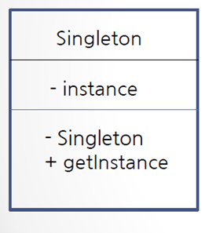

# 18. static 응용 - 싱글톤 패턴(singleton pattern)

## 싱글톤 패턴이란?

- 프로그램에서 **인스턴스가 단 한 개만 생성**되어야 하는 경우 사용하는 디자인 패턴

- **static 변수, 메서드를 활용**하여 구현 할 수 있음 

## 싱글톤 패턴으로 회사 객체 구현하기

- 생성자는 private으로 선언
```java
private Company() {}
```

- 클래스 내부에 유일한 private 인스턴스 생성

```java
private static Company instance = new Company();
```

- 외부에서 유일한 인스턴스를 참조할 수 있는 public 메서드 제공
```java
public static Company getInstance() {
		
	if( instance == null) {
		instance = new Company();
	}
	return instance;
		
}
```
CompanyTest.java
```java
public class CompanyTest {

	public static void main(String[] args) {
		Company company1 = Company.getInstance();
		
		Company company2 = Company.getInstance();
		
		System.out.println(company1);
		System.out.println(company2);
		
		//Calendar calendar = Calendar.getInstance();
	}
}
```



클래스 다이어그램으로 약식으로 표현

맨위부터

1. 클래스 이름
2. 변수
3. 생성자와 메서드

-는 private +는 public 을 뜻함.

## 다음 강의
[19. 복습해봅시다 (static과 싱클톤 패턴)](https://github.com/vivalahm/TIL/blob/main/JAVA/Chapter2/2-19/README.md)
